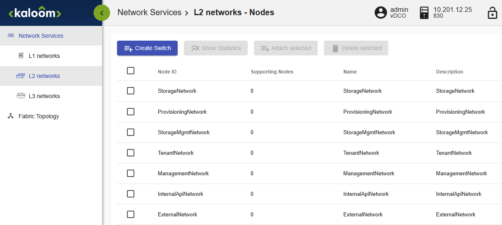
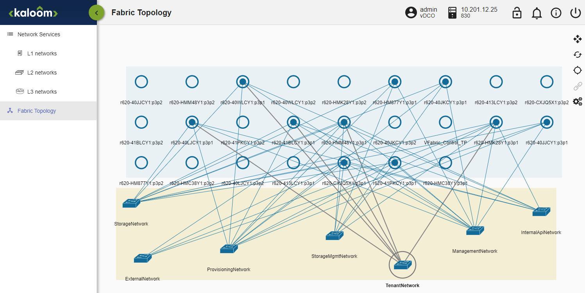
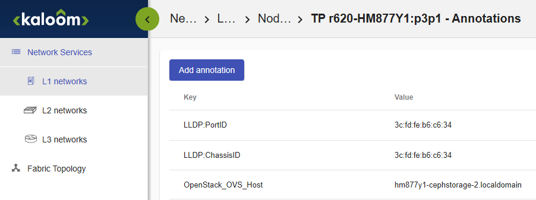

===================================
Neutron Server Plugin Configuration
===================================

The plugins/ml2/ml2_conf.ini file contains configuration for the ML2 plug-in.

1. Edit the ml2_conf.ini file and add the following section to the end. Be sure to have the correct values for each variable.

::

   [KALOOM]
   # Kaloom VFabric controller IP
   kaloom_host=<host address>
   # Kaloom VFabric controller netconf port
   kaloom_port=<port number>
   # Kaloom VFabric controller username
   kaloom_username=<username>
   #Kaloom private-key file to authenticate to VFabric Controller
   kaloom_private_key_file = "/etc/neutron/plugins/ml2/.ssh/kaloom_netconf"
   # Kaloom password to authenticate to VFabric controller (as fallback)
   kaloom_password=<Kaloom password>

   ##
   ##For L3 Service plugin
   # Sync interval in seconds between L3 Service plugin and Kaloom vFabric.
   # If not set, a value of 180 seconds is assumed. (integer value)
   # If set to 0, the plugin will never sync after first sync.
   l3_sync_interval = 600

2. In the ml2_conf.ini file, update the following variables:

::

   mechanism_drivers=kaloom_ovs,kaloom_kvs,openvswitch
   type_drivers=kaloom_knid,vlan,vxlan,flat
   tenant_network_types=kaloom_knid
   [ml2_type_vlan]
   #default VLAN range: 1-4094, if not mentioned.
   network_vlan_ranges = provider
   #pre-provisioned or non-OpenStack-provisioned VLAN (e.g 1-99) can be excluded as:
   network_vlan_ranges = provider:100:4094

3. From the neutron.conf file, update the following variable:

::

   #use kaloom_l3 instead of router
   service_plugins=qos,kaloom_l3,metering,trunk

4. To configure OVS compute nodes, edit the openvswitch_agent.ini file:

::

   [ovs]
      bridge_mappings = provider:br-provider

5. To configure OVS-DPDK compute nodes edit the openvswitch_agent.ini file:

::

   [ovs]
      bridge_mappings = provider:br-provider
      datapath_type = netdev
      vhostuser_socket_dir = /tmp

6. Update the l3_agent.ini file.

::

   interface_driver = neutron.agent.linux.interface.OVSInterfaceDriver
   #external_network_bridge =
   #gateway_external_network_id =

**Configure the UI**

1. Update the local_settings.py file:

::

   OPENSTACK_NEUTRON_NETWORK = {
         'extra_provider_types':  {
             'kaloom_knid': {
                     'display_name': 'Kaloom',
                     'require_physical_network': False,
                     'require_segmentation_id': False,
             },
         },
         'supported_provider_types': ['vlan', 'vxlan', 'kaloom_knid']
         ...
      }

==================================
Neutron Server Plugin Installation
==================================

To install RedHat Director, please refer to `RedHat Director installation and usage guide <https://access.redhat.com/documentation/en-us/red_hat_openstack_platform/13/html/director_installation_and_usage/index>`_.

**Before deploying OpenStack**

1. Create a file - redhat_registry_images_kaloom.yaml

::

   container_images:
   - imagename: registry.connect.redhat.com/kaloom/rhosp13-openstack-neutron-server-kaloom-plugin:0.1.4
     push_destination: <local registry address>:8787

2. Push to local registry

::

   sudo openstack overcloud container image upload \
        --config-file /home/stack/templates/local_registry_images_kaloom.yaml --verbose

3. Verify the image

::

   skopeo inspect --tls-verify=false \
          docker://<local registry address>:8787/kaloom/rhosp13-openstack-neutron-server-kaloom-plugin:0.1.4
   sudo docker image inspect \
        <local registry address>:8787/kaloom/rhosp13-openstack-neutron-server-kaloom-plugin:0.1.4

4. Configure overcloud_images.yaml to point to the Kaloom's images

::
  
  # Red Hat container
  DockerNeutronApiImage: <local registry address>:8787/kaloom/rhosp13-openstack-neutron-server-kaloom-plugin:0.1.4
  DockerNeutronConfigImage: <local registry address>:8787/kaloom/rhosp13-openstack-neutron-server-kaloom-plugin:0.1.4
  

5. Add a postinstall script to update the neutron database. The database upgrade should be part of installation through director templates.

::

   sudo docker exec neutron_api neutron-kaloom-db-manage upgrade head
   sudo systemctl restart neutron-server

.. raw:: latex

        \begin{OriginalVerbatim}[commandchars=\\\{\}]

        \end{OriginalVerbatim}
        \relax

6. Create the infrastructure networks in the vFabric

For each of the application servers, attach the interface that will be used to PXE boot the servers (pxp1 or pxp2). 
Also attach the interface that the Director will use to receive the DHCP requests from the application servers.

.. raw:: latex

        \begin{OriginalVerbatim}[commandchars=\\\{\}]

        \end{OriginalVerbatim}
        \relax

For a minimal installation, it is recomended that the L2 switch should have 10 connections. 
For example:

*       One for the Director
*       Three for the Controller nodes
*       Three for the Ceph nodes
*       Three for the Compute nodes

**Note:** A converged setup is also supported.
For example:

*       One for the Director
*       Three for the Controller nodes
*       Three for the Compute & Ceph nodes

.. raw:: latex

	\begin{OriginalVerbatim}[commandchars=\\\{\}]
		
	\end{OriginalVerbatim}
	\relax

An L2 switch can be created through the KFM or by using NETCONF commands. For more information on creating an L2 switch, refer to the Kaloom vFabric Operations Guide or the Kaloom vFabric NETCONF Operations Guide.

.. raw:: latex

        \begin{OriginalVerbatim}[commandchars=\\\{\}]

        \end{OriginalVerbatim}
        \relax

.. raw:: latex

        \begin{OriginalVerbatim}[commandchars=\\\{\}]

        \end{OriginalVerbatim}
        \relax

OSP Fabric Topology

.. raw:: latex

        \begin{OriginalVerbatim}[commandchars=\\\{\}]

        \end{OriginalVerbatim}
        \relax

7. Add OpenStack_OVS_Host annotations including the server hostnamea to the connected termination points

.. raw:: latex

        \begin{OriginalVerbatim}[commandchars=\\\{\}]

        \end{OriginalVerbatim}
        \relax

.. raw:: latex

        \begin{OriginalVerbatim}[commandchars=\\\{\}]

        \end{OriginalVerbatim}
        \relax

8. Execute the OpenStack Deployment as per `RedHat Director installation and usage guide <https://access.redhat.com/documentation/en-us/red_hat_openstack_platform/13/html/director_installation_and_usage/index>`_.

.. note::  The neutron server and horizon containers can be updated after a clean OpenStack installation.

