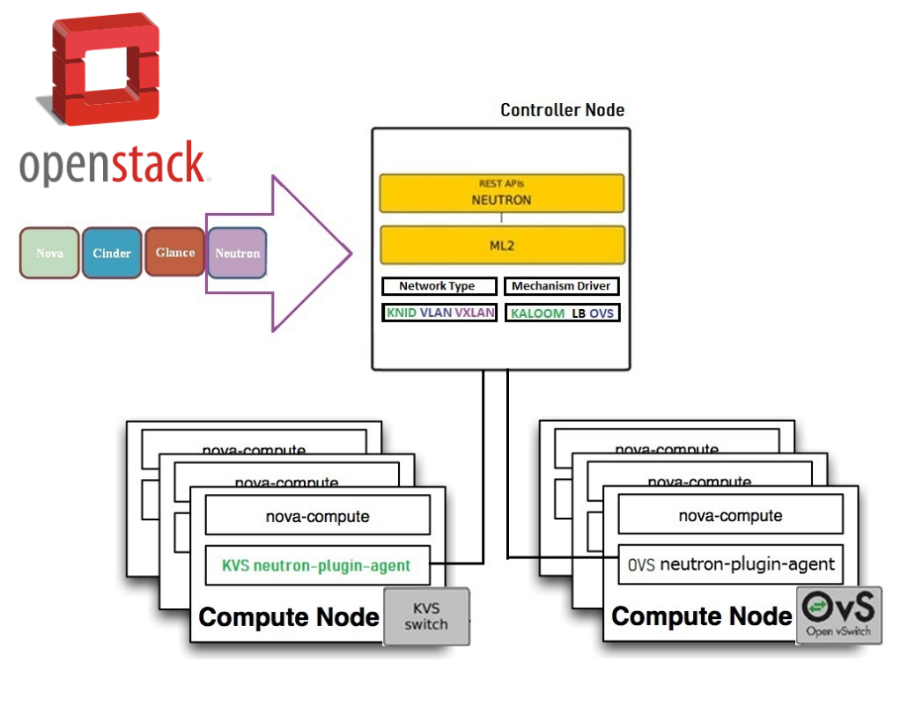

============
Introduction
============

This document provides the Kaloom Software Defined FabricTM (SDFTM) Virtual Data Center Operators (vDCOs) with instructions on how to configure nodes using the Neutron Server Plugin to integrate OpenStack with the Kaloom SDF.

*Target Audience*
#################

This document is intended for vDCOs that intend to use OpenStack with their vFabric. Users of this guide should have solid knowledge of and/or training in the following:

* OpenStack
* Kaloom SDF
* Networking
* Linux

*Objectives*
############

The objective of this document is to instruct vDCOs on the following:

* Neutron Server plugin
* Neutron Server installation and configuration
* Neutron Server verification

*Prerequisites*
###############

The requirements for an effective installation, configuration and operation of the Neutron Server Plugin are addressed in this section.  The installation requirements comprise of a combination of integrated key software and hardware components.

*Hardware*
**********

* One host machine for the Red Hat OpenStack Platform director
* Three host machines for Red Hat OpenStack platform compute nodes
* Three machines for Red Hat OpenStack platform controller nodes, in a cluster
* Three host machines for Red Hat Ceph storage nodes, in a cluster

*Software*
**********

* A Kaloom SDF custom topology successfully deployed with at least the minimum recommended number of Leaf, Spine and Controller nodes
* An active installation of the Kaloom Fabric Manager (KFM) connected to the Kaloom SDF or a NETCONF client installed with access the SDF NETCONF API
* An RedHat Director with OpenStack Queens environment installed connected on a vFabric to at least one pair of Kaloom SDF Leaf node ports
* Neutron Server plugin pre-release software distribution, version 0.1.4 or higher

*KVS Requirements*
******************

There are additional hardware and software requirements needed when using KVS on OpenStack compute nodes. For example, the installation of a Kaloom SDF validated Network Interface Card (NIC) exposed to the Kaloom SDF. 
For more information on the KVS hardware and software requirements, see the KVS Installation and Configuration Manual. 

*Neutron Server Plugin Operation Overview*
##########################################

The Neutron Server Plugin is a mechanism to allow OpenStack to efficiently use the Kaloom SDF networking functions. Furthermore, the use of KVS on OpenStack compute nodes enables OpenStack to natively communicate with the Kaloom SDF. 
The Neutron Server Plugin is implemented based on the Neutron Server framework. It enables OpenStack to create a Kaloom L2 and L3 networks in a vFabric and OpenStack nodes with either Open Virtual Switch (OVS) or the Kaloom Virtual Switch (KVS).

*Neutron Server Architecture*
#############################

The Neutron Server Plugin Architecture requires the Neutron Server mechanism and the Neutron Server network type drivers in OpenStack controller node to integrate with the Kaloom SDF, the Kaloom KVS agents and the default Neutron Server OVS agents. The KVS/OVS agents running on OpenStack nodes configure KVS/OVS in the OpenStack compute node. A modular view of the Kaloom Neutron Server Architecture featuring two Neutron Server driver components and Neutron Server plugin agents is depicted in Figure 1.

